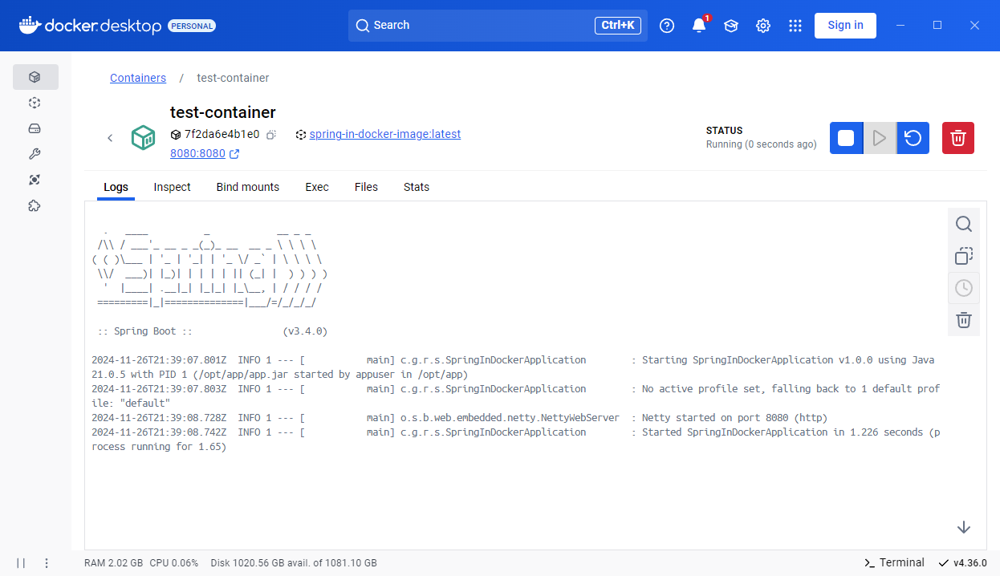
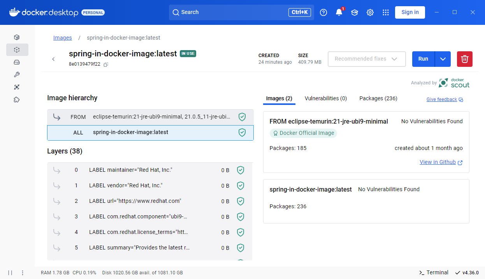

# Spring-Boot Docker Image

This repository serves as an example of a Java/SpringBoot application that is built in a secure Docker container.

The example application has a REST-Endpoint **/rest/hello-world** that returns random data.
The BASH script **create-and-export-docker-image.sh** is used to build the application and embed it in a Docker image.

### **To run without Docker**
```
> mvn clean package -DskipTests
> java -jar target/spring-in-docker-1.0.0.jar
```

### **To run with Docker**
```
> mvn clean package -DskipTests
> docker build -t <image-name>
> docker run -d -p 8080:8080 <image-name>

> docker stop <container-id>
```

### **Dockerfile**
```dockerfile
FROM eclipse-temurin:21-jre-ubi9-minimal
ENV APP_DIRECTORY="/opt/app"
ENV APP_USER="appuser"
ENV APP_USER_GROUP="appuser"

RUN mkdir ${APP_DIRECTORY}
RUN groupadd -r $APP_USER_GROUP && useradd -r $APP_USER -g $APP_USER_GROUP
WORKDIR ${APP_DIRECTORY}

COPY /target/*.jar app.jar
RUN chown -R $APP_USER:$APP_USER_GROUP $APP_DIRECTORY

USER $APP_USER
EXPOSE 8080
ENTRYPOINT ["java","-jar","./app.jar"]
```

A separate application directory **\$APP_DIRECTORY** is created for the application, which belongs to application user **\$APP_USER**:**\$APP_USER_GROUP**.

### **Bash Script**
```shell
#!/bin/bash

IMAGE_NAME=spring-in-docker-image

echo "> Step 1/3: Creating JAR"
mvn clean package -DskipTests
echo "> Step  1/3: Creating JAR - COMPLETED!"

echo "> Step  2/3: Creating Docker Image ..."
docker build -t $IMAGE_NAME .
echo "> Step  2/3: Creating Docker Image - COMPLETED!"

echo "> Step  3/3: Exporting Docker Image ..."
docker save -o ./target/$IMAGE_NAME.tar $IMAGE_NAME
echo "> Step 3/3: Exporting Docker Image - COMPLETED!"
```


### **Output**



